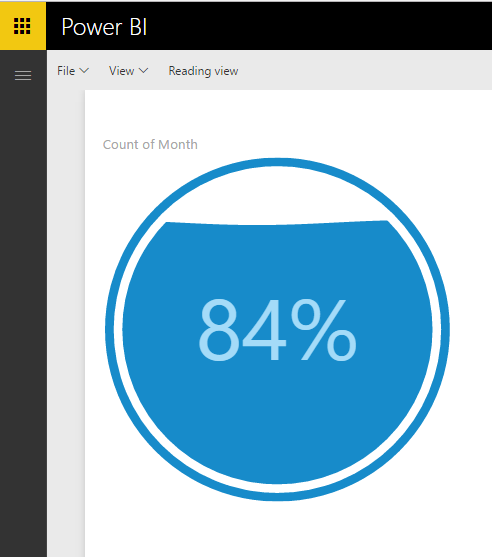

# Liquid Fill Gauge - Power BI Custom Visual

This Power BI Custom Visual represents a percentage in a circular wave form bubble. You can use this visual in your reports via the pbiviz file [here](liquidFillGauge/dist/liquidFillGauge.pbiviz).

See how this visual was built [here](http://bit.ly/pbiviz-oss). 

The original liquidFillGauge code was published by [Curtis Bratton](https://gist.github.com/brattonc/5e5ce9beee483220e2f6)